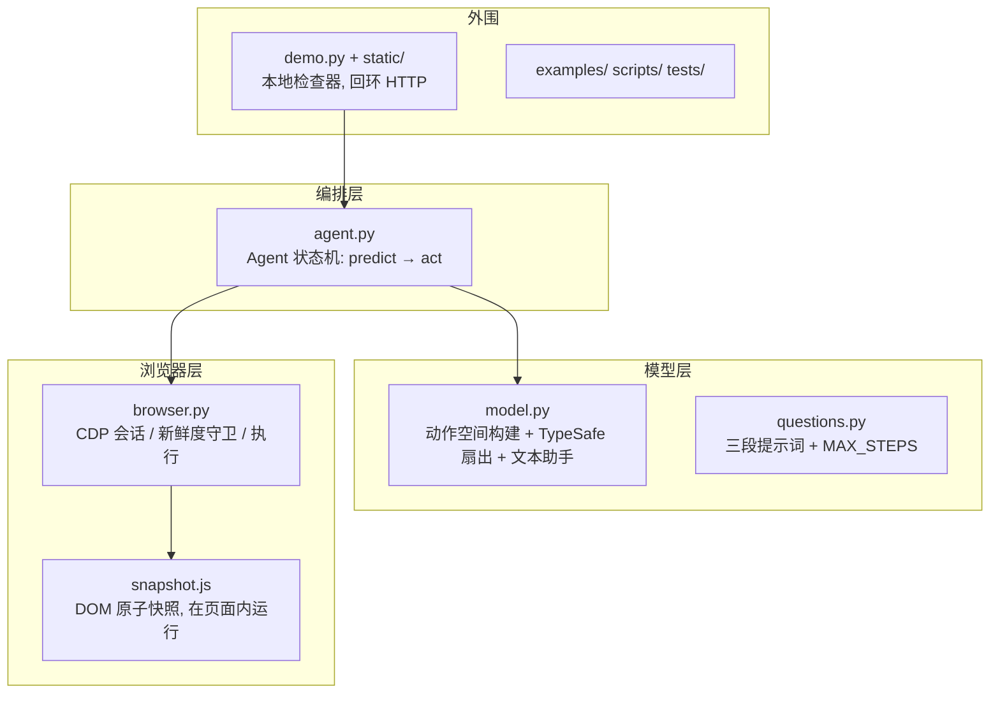

# 01 · 架构总览

> 本文档回答：这个项目是什么、为什么快、代码怎么分布。所有结论均可对照源码验证（标注了文件与行号，基于 2026-10-06 的 main 状态）。

## 项目定位

Jev Ultrafast 是一个**浏览器智能体（browser agent）**，核心思想一句话概括：

> 不给模型让它"生成代码/选择器"的自由，而是每次观察页面后构建一个**有限的、带索引的动作空间**，让模型只做**选择题**；唯一需要生成文本的地方（输入框填值）交给一个小 LLM。

官方 README 的定位语是 "A browser agent with a dynamic, indexed action space"（动态、带索引的动作空间）。

## 三个"一"：快的来源

| 设计 | 含义 | 代码证据 |
| --- | --- | --- |
| **一次请求一个决策** | 操作类型（CLICK/TYPE_TEXT/…）和所有候选目标放在**同一个 TypeSafe 请求**里扇出（fan-out），不用"先问操作、再问目标"的两次串行调用 | `model.py:81-148`（`choose()` 只调用一次 `post_json`） |
| **一次浏览器读取一个快照** | 每个决策周期只跑一次 `Runtime.evaluate` 原子读取整页状态（元素、值、可见文本、几何） | `browser.py:188-193`（`browser_operation` 的 observe 分支） |
| **一个动作一次执行** | 模型输出永远映射到"观测到的元素"，绝不变成选择器、坐标或 JS；执行前重新解析几何并做遮挡检测 | `browser.py:141-168` |

README 宣称的实测收益：同一任务上，对比传统方案中位耗时 9.450 s → 7.092 s（-25%），浏览器协议调用 1,092 → 101 次（数据来源：`README.md` "Why it moves" 一节、`docs/performance.md`）。注意这是"一个任务、三次重复"的结果，不是通用基准。

## 系统分层



## 一次决策周期的数据形状

```
页面 DOM ──snapshot.js──▶ page 字典 ──action_space()──▶ 元素表 + 各操作目标表
                                                              │
                                              目标 LLM (TypeSafe, 一次请求)
                                                              ▼
                                              decision {choice, operation, target, ...}
                                                              │
                                              browser.act(): 守卫检查 + 真实输入
                                                              ▼
                                              新 page 字典 ──▶ 下一轮
```

## 目录结构地图

```
jev-ultrafast/
├── jev_ultrafast/
│   ├── agent.py      # 174 行  决策循环状态机：tick/predict/act 命令协议（编排层核心）
│   ├── model.py      # 198 行  动作空间构建、TypeSafe 请求扇出、答案校验、文本助手（模型层核心）
│   ├── browser.py    # 194 行  CDP 连接、页面新鲜度守卫、动作执行（浏览器层核心）
│   ├── snapshot.js   # 107 行  在页面内运行的 DOM 快照：角色推断、命名、元素索引、marker/guards
│   ├── questions.py  #  26 行  三段提示词（NEXT_ACTION / TARGET / TEXT_VALUE）+ MAX_STEPS=60
│   ├── demo.py       # 145 行  回环专用检查器：HTTP 服务 + 场景管理 + 录制
│   └── static/       #       检查器前端（app.js 244 行 / index.html / style.css / fixture.html 测试夹具）
├── examples/
│   ├── run.py        #  15 行  库用法：任意 URL + 目标
│   └── flights.py    #  68 行  Google Flights 实测 + 独立结果验证 verify()
├── scripts/
│   ├── check_guards.py   # 本地真实浏览器守卫回归（无模型调用）
│   ├── record_flights.py # 录制原始浏览器时间戳
│   ├── render_demo.py    # 将录制渲染成 1× 视频
│   ├── measure_flights.py / smoke.py / render_fixture.py
├── tests/test_agent.py   # 320 行 离线契约测试（全部 mock，不花钱）
├── docs/             # 设计文档、性能测量、demo 素材
└── pyproject.toml    # uv 管理；依赖仅 browser-harness==0.1.13 + httpx[http2]
```

代码总量约 3,400 行（含 CSS/HTML/JS），其中核心 Python 包 `jev_ultrafast/` 仅约 740 行——README 自称 "Small enough to read"，属实。

## 两条调用路径

1. **库调用**：`Agent(url, goal)` → `agent.run()` 生成器逐 tick 产出状态（`examples/run.py`）。
2. **检查器**：`uv run jev` 启动回环 HTTP 服务（默认 8766 端口），浏览器里人工/自动单步驱动同一个 `Agent`（`demo.py`）。

两条路径共用同一个 `Agent.command()` 协议，检查器只是加了 HTTP 外壳和截图。

## 关键数字速查

| 数字 | 含义 | 位置 |
| --- | --- | --- |
| 60 | MAX_STEPS，单任务动作预算 | `questions.py:26` |
| 120 | 决策请求预算（MAX_STEPS × 2） | `agent.py:75` |
| 250 | 单页动作候选上限，超出截断且不可选 | `snapshot.js:99-100` |
| 6000 | 可见文本 / 字段上下文 / 守卫上下文的字符上限 | `snapshot.js:92`、`model.py:155` |
| 1120×780 | 固定视口 | `browser.py:25` |
| 200 ms / 50 ms | 输入后等待上限：可编辑 combobox / 其他交互 | `browser.py:56` |
| 100 ms | 显式 WAIT 动作的时长 | `browser.py:104` |
| 15 s | 初始页面加载轮询 deadline | `browser.py:29` |
| 25 s | 模型 HTTP 超时 | `model.py:12` |
| 7 | 保留动作种类：CLICK, TYPE_TEXT, SELECT, SCROLL_UP, SCROLL_DOWN, WAIT, DONE/BLOCKED | `model.py:51,90`、`snapshot.js:102-104` |

## 阅读建议

- 只有 10 分钟：读本篇 + [05-端到端执行流程](05-端到端执行流程.md)。
- 准备改代码：[02-决策循环](02-决策循环-Agent.md) → [06-二次开发指南](06-二次开发指南.md)。
- 想理解为什么这么设计：[07-设计决策与已知边界](07-设计决策与已知边界.md)。
