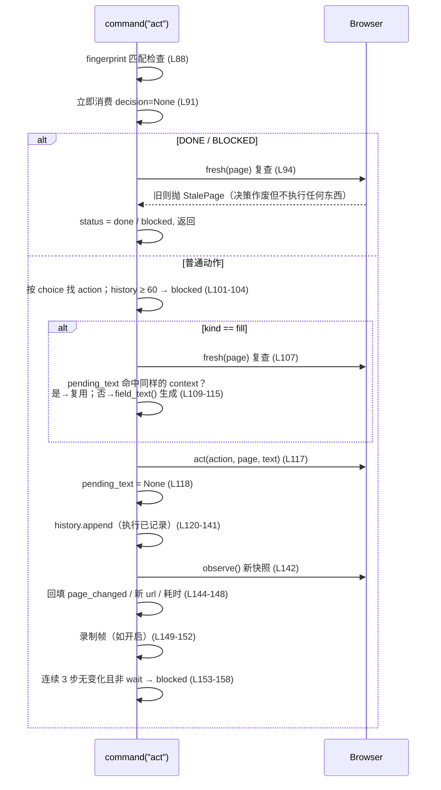

# 02 · 决策循环（agent.py 深度解析）

> `jev_ultrafast/agent.py` 共 174 行，是整个系统的中枢。本文讲清它的状态机、命令协议、每一步的守卫顺序，以及为什么这个顺序不能乱。

## Agent 是什么

`Agent(url, goals, *, record_dir=None, screenshots=False)`（`agent.py:13`）：

- 构造时立即打开浏览器并做**首次观察**（`agent.py:22-23`），失败则关闭浏览器并抛异常——不存在"没有页面状态"的 Agent。
- `goals` 可以是字符串或多行字符串列表，会合并为一个 `goal`。
- `record_dir` 非空时自动开启截图，并按时间戳保存帧（`000000.jpg` 是初始帧，`agent.py:42-44`）。
- 支持 `with` 语法（`agent.py:170-174`），退出时关闭浏览器目标页。

## 命令协议：一切皆 command

对外只有两个入口，但都汇入 `command(name, body)`（`agent.py:52`）：

| 命令 | 语义 | 关键行 |
| --- | --- | --- |
| `tick` | `predict` + `act` 的组合；`act` 抛 `StalePage` 时不重试执行，而是重新观察、状态回 `ready`，本次 tick 安全放弃 | `agent.py:55-64` |
| `predict` | 页面变旧则先重新观察；调 `choose()` 得到决策；状态 → `predicted` | `agent.py:65-85` |
| `act` | 消费决策并执行；状态 → `ready` / `done` / `blocked` | `agent.py:86-158` |

`run()` 就是 `while status not in {done, blocked}: yield tick`（`agent.py:163-165`）。

## 状态字典（self.state）

`agent.py:27-41` 初始化的完整字段，也是 `snapshot()` 的输出（`browser` 对象会被剔除，`agent.py:46-50`）：

| 字段 | 含义 |
| --- | --- |
| `browser` | `Browser` 实例（仅内部使用，不出 snapshot） |
| `goal` / `plan` / `plan_index` | 目标文本；plan 目前是单元素列表，`plan_index` 在 DONE 时置 1 |
| `page` | 最近一次观察的 page 字典（见 [04](04-浏览器执行与DOM快照.md)） |
| `decision` | 待执行的决策；**只能被消费一次** |
| `history` | 已执行动作列表，每条含概率、耗时、文本、page_changed 等 17 个字段 |
| `decisions` | 每次 predict 的完整决策（含原始请求），用于预算统计与检查器回放 |
| `text_calls` | 文本助手的每次调用记录 |
| `status` | `ready` / `predicted` / `done` / `blocked` |
| `elapsed_ms` / `started_at` | 计时（首次 predict 才开始计时，`agent.py:68-69`） |
| `record` | 是否保存截图帧 |

## predict 的守卫顺序（`agent.py:65-85`）

1. 无浏览器 → 报错。
2. `started_at` 为空则开始计时。
3. `browser.fresh(page)` 为假 → **先重新观察**，再决策（页面变了绝不基于旧状态问模型）。
4. 已 `done`/`blocked` → 拒绝（`agent.py:73-74`）。
5. 决策请求数 ≥ 120 → 拒绝（`agent.py:75-76`）。
6. 调 `model.choose(page, goal, history)`；把决策连同页面 fingerprint、耗时存入 `decisions`。

## act 的执行顺序（`agent.py:86-158`）——本文件最重要的部分

### 为什么"先消费、后执行"（L90-91 注释原文）

> Consume once, before any mutation or model call. A retry cannot double-click.

决策在**任何浏览器变更或模型调用之前**就被清空。这样即使后面抛 `StalePage` 或文本生成失败，重试也绝不会导致重复点击——测试 `test_stale_decision_is_consumed_before_any_mutation` 锁死这个行为。

### 为什么"先记 history、再观察"（L120 注释原文）

> Record execution before observing. A stale post-action observation must not erase the action.

动作先落历史，然后才做下一次观察。如果观察时页面正在跳转（`StalePage`），已执行的动作**不会被吞掉**——测试 `test_stale_observation_preserves_executed_action` 锁死。

### pending_text：陈旧决策下的文本复用（`agent.py:110-115, 118`）

- 只有 `field_context(goal, action, page, history)` **逐项相等**时才复用上次生成结果（AGENTS.md 同款规则："Cache a stale retry's value only while its entire helper input is identical"）。
- 成功执行后 `pending_text` 立即清空。
- 文本生成前有一次 `fresh()` 复查（L107），执行时 `Browser.act` 内部还会再查一次——三层守卫。

### 终止与预算

| 条件 | 结果 |
| --- | --- |
| 模型选 DONE 且页面仍 fresh | `done`（仍需外部独立验证才算成功，见 `examples/flights.py:18-38`） |
| 模型选 BLOCKED 且页面仍 fresh | `blocked` |
| history 达 60 条 | 下一个动作直接 `blocked`（`agent.py:102-104`） |
| 决策请求达 120 次 | predict 直接拒绝 |
| 最近 3 步 `page_changed` 全为 False 且都不是 wait | `blocked`（防死循环；wait 不算，测试 `test_loading_waits_do_not_trigger_no_progress_stop`） |

## tick 的陈旧语义（`agent.py:55-64`）

`tick` 里 `act` 抛 `StalePage` 的语义是"放弃本轮，重新观察"：decision 清空、status 回 `ready`、elapsed 更新，返回新 snapshot。**绝不自动重放同一个决策**——重放决策是双重执行风险的来源。

## 与检查器的关系

`demo.py` 前端有三个按钮：`Choose next`（predict）、`Execute`（act）、`Run automatically`（循环 tick）。前端 act 时会带上 `state.page.fingerprint`（`app.js:163-167`），后端用它防止"观察到一半页面变了还执行"（`agent.py:88`）。检查器用非阻塞锁串行化步骤（`demo.py:111-112`），并发请求返回 409。
