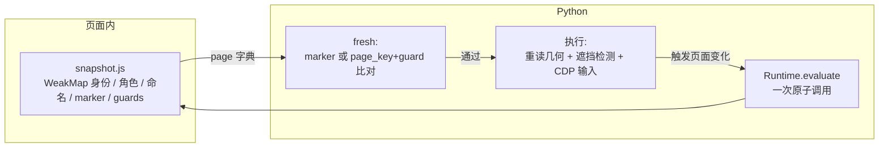

# 04 · 浏览器执行与 DOM 快照（browser.py + snapshot.js）

> 这一层回答两个问题：**页面状态如何被原子地读出来**（snapshot.js），以及**一个决策如何被安全地执行**（browser.py）。所有"快且稳"的守卫逻辑都在这里。

## 一、snapshot.js：页面内的观察器（107 行，在浏览器里运行）

`snapshot.js` 是一个 IIFE，由 Python 侧整体读入并 `Runtime.evaluate` 执行（`browser.py:13, 188`），返回 null（无 body / 正在导航）或一个 page 字典。

### 1. 节点身份体系：代码持有，模型不可见

```javascript
window.__jevFast = { ids: new WeakMap(), nodes: new Map(), next: 1 }  // snapshot.js:3
```

- 每个 DOM 节点第一次被看到时分配一个自增整数 id（WeakMap 记录节点→id）。
- `nodes: Map` 保存 **id → 真实 DOM 引用**，供执行阶段使用——这是"模型输出永远映射到观测到的节点"的实现基础。
- 每次快照清理已断开的节点（`snapshot.js:8`）；导航后新文档会自然重建缓存。
- **这些 id 不是 CDP 的 backendNodeId**，只在本页面的 JS 世界里有效。

### 2. 可见性与安全性过滤

- `safe`：排除 `type ∈ {password, file, hidden}` 的输入框（`snapshot.js:9`）——密码框永远不会出现在动作空间里。
- `visible`：祖先无 `[aria-hidden="true"]`/`[inert]`，且 `checkVisibility({checkOpacity, checkVisibilityCSS})` 通过（`snapshot.js:10-11`）。
- 跳过禁用控件（`:disabled`、`aria-disabled` 祖先，`snapshot.js:57`）、零尺寸和视口外的元素。

### 3. 角色推断（role 函数，`snapshot.js:28-43`）

支持 14 种 ARIA 角色（`snapshot.js:24-25`）。优先级：显式 `role` 属性（且在白名单内）→ 标签推断（BUTTON/SUMMARY→button，A→link，SELECT→combobox，TEXTAREA/contenteditable→textbox）→ INPUT 按 `type` 细分（checkbox/radio/button/search→searchbox/number→spinbutton/text|email|url|tel→textbox）。

### 4. 可访问名计算（name 函数，`snapshot.js:12-23`）

优先级链：`aria-labelledby`（递归解析，带环检测）→ `aria-label` → `<label>` 关联 → input 按钮的 value → `alt` → 文本内容（递归，跳过 aria-hidden）→ `title` → `placeholder`。

注意：这是**常用命名的近似实现**，不是浏览器完整的 accessible-name 规范算法（`docs/design.md` 边界一节明确承认）。

### 5. 动作生成规则（`snapshot.js:55-81`）

每个可见控件产出一条或多条扁平 action：`{node, role, label, rect, kind, value, ...}`。

| 控件 | 产出的 action |
| --- | --- |
| 原生 `<select>` | 每个"未选中且可用"的 option 一条 `kind: "select"`，`label` 形如 `"Category → Design"`，`value` 是 option 的 value |
| 可编辑控件（textbox/searchbox/spinbutton，或 INPUT/TEXTAREA 系的 combobox，且非只读） | 一条 `kind: "fill"` + 一条 `kind: "click"`（label 加前缀 `"Open "`，用于打开日期选择器/下拉） |
| 其他 | 一条 `kind: "click"` |

关键细节：

- **可编辑判定由角色控制**，不是"所有 INPUT 都可打字"——初版曾把复选框误判为可输入，`docs/design.md` 记录了这次修正。
- combobox 的 `value` 取 `innerText`（触发后文本可能出现在浮层里）。
- `gridcell` 内嵌按钮的格子被跳过（`snapshot.js:60`），避免和内部按钮重复。
- 追加三个特殊 action：`scroll_down`/`scroll_up`（delta=560，视滚动位置条件追加）、`wait`（恒有）（`snapshot.js:102-104`）。

### 6. 页面文本（`snapshot.js:82-92`）

TreeWalker 收集**视口内可见**文本节点，拼成 `\n` 分隔的字符串，上限 6000 字符。离屏的页脚/侧栏不进上下文——这是"Send visible text"的内存/延迟优化。

### 7. 新鲜度三件套

| 字段 | 构成 | 用途 |
| --- | --- | --- |
| `page_key` | `[timeOrigin, url, scrollX, scrollY, 视口宽高, 所有安全表单控件的 (id, value, checked, selectedIndex, disabled, readOnly)]`（`snapshot.js:44-46`） | 点击/选择的精细守卫 |
| `guards` | 每个动作节点的守卫快照：`[id, role, name, value, checked, selectedIndex, readOnly, disabled, aria-disabled, aria-expanded, aria-checked, aria-selected, href, 上下文 innerText≤6000]`；上下文 = 最近的 `form/dialog/article/li/tr` 或父元素（`snapshot.js:47-54, 94`） | 点击/选择前的逐项比对 |
| `marker` | `[timeOrigin, url, scrollX, scrollY, 视口, title, text, 动作语义(不含几何), 表单状态]`（`snapshot.js:96-98`） | 其他情况的整页语义比对 |

设计语义（`docs/design.md` 第 17 行）：**比较语义而非数 DOM 变更**；守卫是"作用域"的——无关区域的可见更新不会让点击失效（check_guards.py 有专门断言），但这是实用启发式，不是形式化证明。

### 8. 数量裁剪

动作超过 250 条时截断，`omitted_actions` 记录丢弃数（`snapshot.js:99-100`）。**被截断的候选对模型不可见，因此不可选**——页面控件极多时策略可能"看不到"正确目标。

## 二、browser.py：CDP 会话与执行器（194 行）

### Browser 生命周期（`browser.py:21-33`）

1. `ensure_daemon()` 确保 browser-harness 守护进程在跑；
2. `Target.createTarget` 建一个 **background 标签页**（不抢占用户正在看的 Chrome 标签）；
3. `Target.attachToTarget(flatten=True)` 建立 CDP session；
4. 固定视口 1120×780（`setDeviceMetricsOverride`）；
5. `setFocusEmulationEnabled`——后台标签的 rAF/菜单不被节流，这是"Keep hidden tabs rendering"的实现；
6. 导航并轮询 `document.readyState == "complete"`，deadline 15 s（每 20 ms 一次）。

### observe()：先等页面稳定，再原子读取（`browser.py:44-86`）

1. 若上一步动作设置了 `after_input`（非 wait），先执行一段等待脚本：
   - 可编辑 combobox（`role=combobox` 的 fill）：等 `aria-controls`/`aria-owns` 指向的容器里出现**可见的** `[role=option]`，上限 200 ms；
   - 其他交互：2 个 requestAnimationFrame 或 50 ms，先到先走。
   - 这段等待**发生在执行被记录之后**（见 02 篇），导航打断也只是跳过。
2. 然后调 `browser_operation(observe)`，失败（`StalePage`，通常意味着正在导航）最多重试 10 次、每次间隔 20 ms；10 次后抛 "Page did not settle"。

### fresh()：两种新鲜度（`browser.py:88-98`）

```python
def fresh(self, page, action=None):
    if action is not None and action["kind"] in {"click", "select"}:
        # 精细守卫：节点必须是整数 id，逐项比对 page_key + 该节点的 guard
        current = evaluate([c.pageKey(), c.guard(nodes.get(node))])
        return current == [page["page_key"], page["guards"][str(node)]]
    # 整页语义守卫：marker 表达式求值与快照时相等
    return evaluate(MARKER) == page["marker"]
```

MARKER 是一个把 snapshot.js 内联后再取 `marker` 字段的表达式（`browser.py:13-14`）——**同一份语义代码**生成快照和校验指纹，天然一致。

### act()：执行前的最后防线（`browser.py:100-107` + `browser_operation` L135-186）

1. `fresh(page, action)` 不过 → 抛 `StalePage`，**任何浏览器输入都不会发生**（测试 `test_executor_rejects_a_stale_page_before_browser_input`）。
2. `wait` → sleep 0.1 s；`scroll` → 一个 mouseWheel 事件（固定点 550,650，delta ±560）。
3. 其他动作先跑**目标解析表达式**（`browser.py:144-160`），逐项拒绝：
   - 节点不在文档 / 禁用 / `aria-disabled` 或 `inert` 祖先 / 不可见；
   - fill 目标只读；
   - 几何：矩形中心在视口内且非零尺寸——**几何永远在执行前重新读**，快照里的 rect 仅供参考；
   - 遮挡：`elementFromPoint(中心)` 必须包含目标元素（浮层覆盖即拒绝，check_guards.py 的 overlay 测试）；
   - select：必须是原生 `<SELECT>` 且目标 option 存在、未禁用、不在禁用的 optgroup 里。
4. 解析出 `{x, y}` 后才真正输入：
   - **click**：`Input.dispatchMouseEvent` 按下+抬起（clickCount=1）；
   - **fill**：先 `keyDown` 带 selectAll 命令（macOS 修饰键 4/Ctrl，其他平台 2，`browser.py:175`）全选旧内容，再 `Input.insertText` 替换——不是逐键打字；
   - **select**：JS 设置 `value` 并派发 `input`/`change` 事件（原生下拉无法可靠模拟点击打开）。
5. 任一步骤解析返回 null → click/fill 抛 `StalePage`，select 抛 `RuntimeError`（**原生下拉的 change 事件可能已触发，不能当作可重试的陈旧**，`browser.py:130-131`；测试 `test_interrupted_dropdown_mutation_cannot_be_retried_as_stale`）。

### fingerprint()（`browser.py:115-117`）

对 `url + text + actions + scroll` 做 sha256——**不含截图**。检查器用它做"执行时页面还是不是当初那页"的快速比对。

## 三、两者协作的一张图


