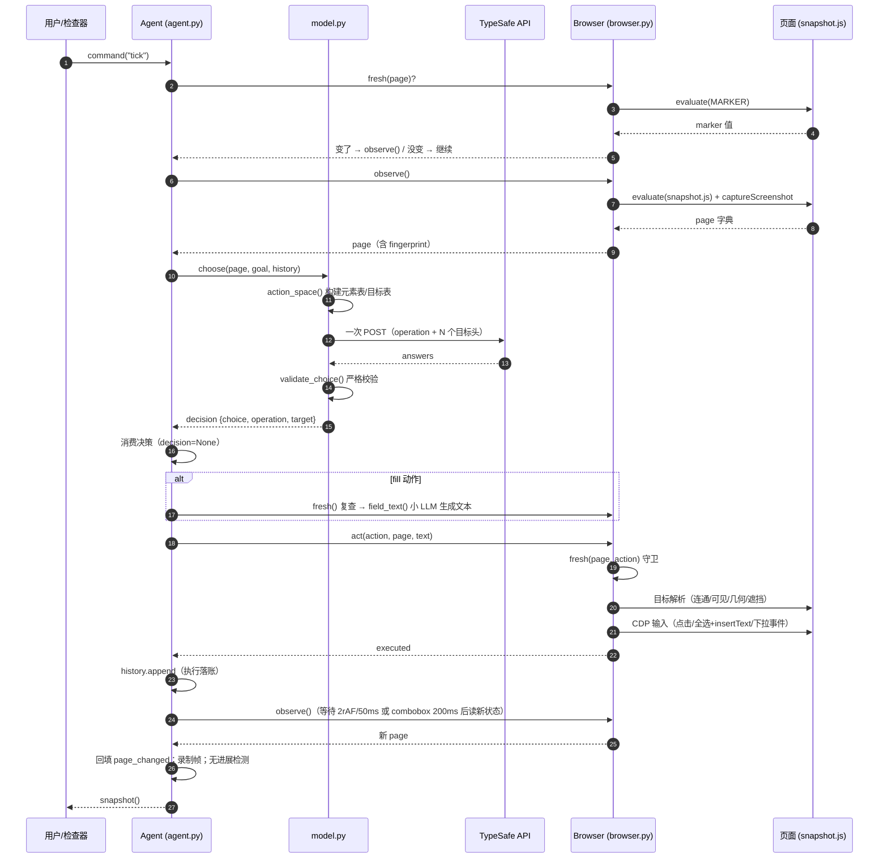

# 05 · 端到端执行流程

> 把前三篇拼起来：从一句自然语言目标，到浏览器里的一次真实输入。附 page 字典完整字段契约和时序图。

## 完整时序（一个 tick）



## page 字典：系统的通用语

`snapshot.js:105-106` 返回、`browser.py:188-193` 补充的完整字段：

| 字段 | 来源 | 说明 |
| --- | --- | --- |
| `url` / `title` | snapshot | 当前地址与标题 |
| `w` / `h` | snapshot | 视口尺寸（固定 1120×780） |
| `text` | snapshot | 视口可见文本，≤6000 字符 |
| `scroll` | snapshot | `{y, height}` |
| `actions` | snapshot | 扁平动作列表，≤250 条，id 为 `e1..eN` + `scroll_down`/`scroll_up`/`wait`；含 `node`（整数）、`role`、`label`、`rect`、`kind`、`value` 等 |
| `marker` | snapshot | 整页语义指纹（见 04 篇） |
| `page_key` | snapshot | 精细守卫基准（见 04 篇） |
| `guards` | snapshot | 每节点守卫快照（见 04 篇） |
| `omitted_actions` | snapshot | 被 250 上限截断的动作数 |
| `fingerprint` | browser.py:191 | sha256(url+text+actions+scroll)，不含截图 |
| `screenshot` | browser.py:192-193 | 可选，JPEG q72 base64；库调用默认关闭 |

## 决策 decision 字典（`model.py:134-148`）

| 字段 | 说明 |
| --- | --- |
| `choice` | 最终动作 id（如 `e7`、`scroll_down`、`DONE`）——给执行层用 |
| `operation` / `target` | 操作名 / 目标索引（选中目标头时非空） |
| `confidence` / `probabilities` | 被选答案的置信度；按**动作 id** 重映射后的目标概率 |
| `operation_probabilities` / `target_probabilities` | 原始头概率（检查器按它排序展示） |
| `raw_answers` / `request` | TypeSafe 原始返回 / 完整请求体（检查器"模型实际看到什么"面板的数据源） |
| `model` / `usage` / `latency_ms` | 元信息，落 history |

## history 单条字段（`agent.py:121-141`）

`step, action, kind, choice, probability, confidence, latency_ms, text, text_helper, text_latency_ms, operation, target, page_changed, url, usage, executed_ms, elapsed_ms`——检查器的 trace 行、measurement 脚本的统计都从这来。

## 三种"等"的语义（容易混淆）

| 等待 | 触发 | 上限 | 代码 |
| --- | --- | --- | --- |
| 交互后稳定等待 | 每个非 wait 动作执行后的下一次 observe | 可编辑 combobox：可见 option 出现或 200 ms；其他：2 rAF 或 50 ms | `browser.py:51-74` |
| 显式 WAIT 动作 | 模型选择 WAIT（控件缺失/结果加载中） | 100 ms | `browser.py:103-104` |
| 初始加载 | Agent 构造时的首次导航 | 15 s | `browser.py:29-33` |

注意交互后等待**不加速网络加载**——录制视频里加载时间原样保留（`docs/design.md` 第 21 行）。

## 性能设计的落点

README 的 "Why it moves" 逐条对应的实现位置：

| 宣称 | 实现 |
| --- | --- |
| One request per decision cycle | `model.py` 单 POST 扇出（03 篇） |
| No screenshots in the default loop | `Agent(screenshots=False)` 默认；截图仅在检查器/录制时开 |
| One browser call per snapshot | `browser.py:188` 一次 `Runtime.evaluate` |
| Validate the selected target | `browser.py:144-160` 执行前重读几何+遮挡 |
| Wait for useful state | 三种"等"的上表 |
| Keep hidden tabs rendering | `browser.py:27` focus emulation |
| Send visible text | `snapshot.js:82-92` 视口文本 6000 上限 |
| Reuse an interrupted text request | `agent.py:110-115` pending_text |

## 验证闭环（开发时怎么用）

```
pytest                # 离线契约：mock 模型/浏览器，锁死所有安全行为（tests/test_agent.py）
check_guards.py       # 本地真实浏览器：守卫矩阵（移动目标/覆盖层/无关变更/原生控件），无模型调用
examples/flights.py   # 线上实测 + verify() 独立断言最终页面（不信模型的 DONE）
```
